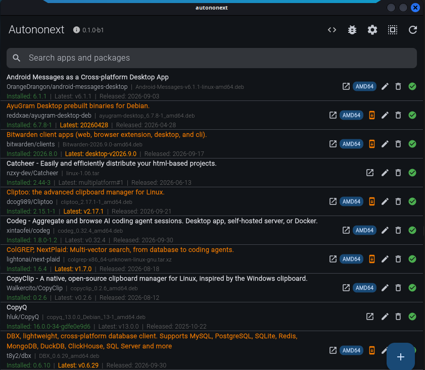
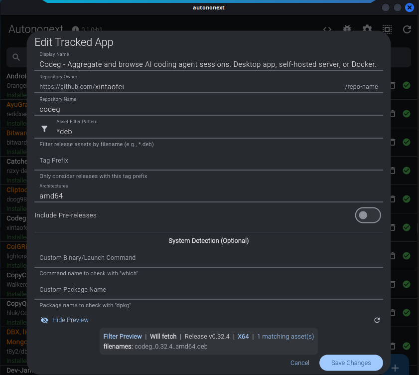

# Autononext

A Linux package manager for GitHub releases, built with Flutter.

Autononext helps you track, install, update, and manage applications distributed via GitHub releases. It provides a clean, modern GUI for managing your GitHub-sourced applications with support for multiple package formats.

**Autononext is an enhanced version of [Autonomix](https://github.com/ninepointlabs/autonomix)** — it started as a fork of that project and has since had a large number of bug fixes and features added on top of it, including real upgrades for binary and archive installs, install-location detection, release-asset validation, and a rebuilt list UI. The previous repository for this work is [`thexmeta/autonomix`](https://github.com/thexmeta/autonomix); the original upstream is [`ninepointlabs/autonomix`](https://github.com/ninepointlabs/autonomix) (originally `plebone/autonomix`). Upstream is MIT-licensed, `Copyright (c) 2024 PlebOne`; that attribution is retained. Current app version: `0.1.0-b5` (from `pubspec.yaml`).


## Screenshots

The main list — compact rows showing `repository | filename` and `Installed | Latest | Released`,
an architecture badge and the row actions, hairline separators between entries, and available
updates highlighted in orange. The search field filters tracked apps and direct `.deb` entries:



The edit form — every field explanation retained while the dialog stays compact, with the filter
preview reporting the release, architecture and asset filenames the current filter will use:



## Features

### Tracking
- **GitHub repository tracking** — add any GitHub repository and follow its releases
- **Direct `.deb` URL tracking** — track a package by `.deb` URL without a GitHub repository, with an auto-update flag (currently inert — see Known limitations) and a `DIRECT` badge in the list
- **Installed-version detection** — package queries (`dpkg-query`) determine the installed version, and a binary found on `PATH` is resolved to its owning package (`dpkg -S`, or `rpm -qf` on RPM systems) so the version is read from the package rather than by running the binary; only a binary with no owning package is probed with `--version` / `-v`. That means a GUI launcher which ignores its arguments is never started just to check its version. Detection no longer relies on hardcoded `/usr/bin` paths, so it also works on RPM-based and other non-Debian distributions
- **Architecture badge in the app list** — each tracked GitHub app row shows an uppercase badge listing all of its selected architectures (for example `AMD64/ARM64`); not shown for direct `.deb` entries
- **Launch tracked applications** from the UI, with package-name / launch-command auto-discovery in the add and edit dialogs; launch commands may include arguments
- **Stop tracking / remove from list** — distinct from uninstall: removes the entry from Autononext without touching the installed package
- **Edit tracked entries** — edit an existing tracked GitHub app's fields including its filter settings, with live preview; and edit a direct `.deb` package's name, URL and auto-update flag
- **Search** — a search field above the list filters tracked apps and direct `.deb` packages as you type, matching display name, repository owner/name, package name and launch command; clearing it restores the full list, and Select All applies only to the rows the filter shows

### Release Discovery & Filtering
- **Release discovery** with prerelease filtering and an optional include-prereleases toggle
- **Resilient release parsing** — a malformed or unexpected entry in a GitHub releases response is skipped instead of aborting the whole release list
- **Per-app asset filtering** by comma-separated glob patterns (case-insensitive `*` / `?`)
- **CPU architecture selection** with alias matching: amd64 / x86_64 / x64, arm64 / aarch64, arm / armhf / armv7, i386 / x86
- **Foreign-platform assets are never selected** — an asset naming another OS (`darwin`, `macos`, `osx`, `win32`, `win64`, `windows`, `mingw`, `msvc`, `cygwin`, `freebsd`) or carrying a platform extension (`.exe`, `.msi`, `.dmg`, `.pkg`, `.app`, `.apk`, `.aab`, `.ipa`) is rejected before architecture matching, so a macOS or mobile build can never be chosen for a Linux host
- **Release tag matching by prefix** — the Tag Prefix field matches any tag that *begins with* the value (case-insensitive)
- **Filter validation** — the Add and Edit dialogs reject a whitespace-only filter pattern with a message, and the Tag Prefix field has genuine format validation; glob patterns themselves are accepted as-is (matching is throw-safe, so a pattern containing regex metacharacters cannot crash the app)
- **Live filter preview** showing which release and assets the current filter will match, debounced at 500 ms
- **Filter preview layout** — the preview is two aligned lines: `Filter Preview | Will fetch | Release <tag> | <ARCH> | N matching asset(s)`, then `filenames: <name>, <name>, …`; the architecture is shown inline (for example `X64/ARM64`) and the filename line carries a `(+N more)` indicator when the release has more than three assets
- **Filter preview empty state** — a dedicated "no results" state when the current filter matches nothing
- **Filter preview loading and error states** — the preview shows a loading indicator while fetching and an error message on failure
- **Version comparison handles real-world tags** — a product-prefixed tag (`desktop-v2026.9.0`, `alpha-v2026.9.25-alpha.0006`) and an npm release tag (`@biomejs/biome@2.5.15`) both compare by their embedded version, so a genuine update is still detected; a latest value that is not a version at all (`multiplatform#1`) is never advertised as an upgrade

### Installation & Management
- **Install / upgrade / uninstall / launch** for:
  - **`.deb`** — install via `pkexec apt-get install -y`; uninstall via `pkexec dpkg -r`
  - **`.rpm`** — install via `pkexec rpm -i`; uninstall via `pkexec rpm -e`
  - **AppImage** — copied into `appimages/` and made executable with `chmod +x`
  - **Flatpak** — install via `flatpak install -y`; uninstall via `flatpak uninstall -y <app-id>` when an app id has been recorded, otherwise a clear error is reported
  - **Binary / archive** — `.tar.gz`, `.tgz`, `.tar.xz`, `.txz`, `.tar.bz2`, `.tbz2`, `.tar.zst`, `.zip`, and extension-less raw binaries (see below)
- **Check, Upgrade and Install mean different things** — "Check for Updates" only refreshes release metadata, "Upgrade" downloads a newer release and installs it over the existing one, and "Install" is offered only when nothing is installed yet
- **The row action performs a real upgrade** — it selects the asset, downloads it, installs it and records the new version. It previously only re-checked for a newer release and reported success without installing anything
- **Binary and archive installs** — an archive is extracted to a temporary directory and its executable is located by exact name match first, then by the executable bit; a raw download is installed directly
- **Every payload must be an ELF executable** — the magic bytes are checked before anything is installed, so an archive that contains no executable is refused with "This entry cant be installable. It doesnt include binary/executable." rather than installing a script, a README or a Python source distribution
- **Install location is detected, not assumed** — the target is resolved from the recorded launch command first, then the directories on `PATH`, then well-known locations (`~/.local/bin`, `/usr/local/bin`, `/usr/bin`, `/opt/*/bin`); the user is asked to choose only when more than one candidate exists
- **Package-managed targets are flagged** — when the resolved target is owned by `dpkg` (or `rpm`), the app warns that overwriting it desyncs the package manager and requires explicit confirmation
- **Install targets are validated** — a non-absolute path, a directory, a symlink, a non-regular file, a `-`-prefixed name and anything under `/dev`, `/proc` or `/sys` are rejected before anything is written
- **The previous binary is backed up first** — an existing target is copied to `<target>.bak` before it is replaced, beside the target when possible and otherwise into the app data directory under a name keyed by a hash of the full target path
- **Replacement is atomic** — the new binary is staged next to the target and moved into place with `rename(2)`, so the target is never missing or half-written
- **Downloads are HTTPS-only and size-capped** — a plaintext URL is refused, a redirect that downgrades to plaintext is refused, and a body larger than 1 GiB is aborted with the partial file removed
- **No silent downgrades** — a release that is not newer than the installed version is refused rather than written over it
- **Choose between several assets of the same type** — when a release ships more than one asset of the chosen format (a GUI and a CLI AppImage, for example) the app asks which to install instead of silently taking the first one. A release that ships one build per architecture is *not* treated as a choice: the build matching the app's architectures / the host architecture is picked automatically.
- **Post-install cleanup** — downloaded package files are removed after a successful install
- **Uninstall clears recorded state** — uninstalling an app clears its recorded installed state and launch command, so it is no longer left recorded as installed
- **Startup update check** for tracked GitHub applications (once per session, and only when tracked apps exist); direct `.deb` packages are not checked at startup, and manual refresh and per-app checks are also available

### Data & Diagnostics
- **Settings persistence** in `settings.json`: optional GitHub personal access token (sent as `Authorization: Bearer`), releases-per-page, default CPU architecture, and theme
- **Settings: Reset button** for releases-per-page, restoring the default of 100
- **Releases-per-page is clamped to 1–100** in both the settings UI and the service
- **Configuration export/import** — export writes `autononext-export-<date>.json`; import reads a fixed `autononext-import.json`. Both use fixed filenames in the app config directory; there is no file picker
- **Import merges rather than replaces** — importing skips entries that already exist, so an import is additive
- **Import result summary** — the number of imported apps is reported back to the user
- **Export metadata envelope** — exported files carry a metadata header with schema version, export timestamp, app name and app version; the app version is read from the package metadata
- **Debug logger** writing `autononext_debug.log`, plus an in-app log viewer with a Clear action
- **Bounded debug log** — the log is capped at 1 MB and rotates by keeping the most recent portion, so it cannot grow without bound; the in-app viewer reads only the most recent 200 KB and indicates when it truncates
- **Token-safe debug log** — the settings dump logs only setting names and never records the GitHub token
- **Debug logging toggle** — debug logging can be turned off via the `enable_debug_logging` setting
- **Version-comparison logic** used to decide whether a newer release exists
- **Debian revision-aware `.deb` comparison** — direct `.deb` version comparison understands Debian revisions, so `1.0.0-1` → `1.0.0-2` is correctly detected as an update

### Building and Testing

```bash
make dev          # run in debug mode
make build        # build release
make build-deb    # build Debian package
make build-rpm    # build RPM package
make build-all    # build all packages
make bump-build   # bump build number
make bump-patch   # bump patch version
make help         # list available targets
```

Tests run with `flutter test` (there is no `make test` target); 31 test files plus shared mocks under `test/`. The project is verified clean with `flutter analyze` (no issues found) and `flutter test` (312 tests passing).

## Installation

Prebuilt packages are attached to every tagged release on the [Releases page](https://github.com/thexmeta/autononext/releases). The current version, `0.1.0-b5`, is a pre-release.

### Debian / Ubuntu

```bash
sudo dpkg -i autononext_0.1.0.b5_amd64.deb
```

Installs to `/opt/autononext` with a symlink at `/usr/local/bin/autononext`.

### Fedora / RHEL / CentOS

```bash
sudo rpm -i autononext-0.1.0-0.b5.x86_64.rpm
```

Installs to `/opt/autononext` with a symlink at `/usr/bin/autononext`.

### Any Linux x64 (portable tarball)

```bash
tar -xzf autononext-0.1.0-b5-linux-x64.tar.gz
./bundle/autononext
```

### From Source

```bash
git clone https://github.com/thexmeta/autononext.git
cd autononext
flutter pub get
flutter build linux --release
```

### Building the packages yourself

```bash
make build-deb    # -> dist/debian-x64/autononext_<version>_amd64.deb
make build-rpm    # -> dist/rpm-x64/autononext-<version>-<release>.x86_64.rpm
```

Both packaging scripts install an `autononext.desktop` launcher entry to `/usr/share/applications`, so the app appears in the desktop application menu. The repo also ships the source `autononext.desktop`.

## Architecture

### Technology Stack
- **Language**: Dart (Dart SDK `>=3.0.0 <4.0.0`)
- **Framework**: Flutter (channel `stable`, pinned via FVM — see `.fvmrc`)
- **UI**: Material 3
- **State Management**: Provider
- **Storage**: JSON files
- **HTTP Client**: `package:http` against `api.github.com`
- **System Integration**: `dart:io` `Process` for package management
- **Packaging**: `dpkg-deb` / `rpmbuild`

### Project Structure

```text
lib/
├── main.dart                       # entry point, CLI --version, providers
├── models/                         # data models
│   ├── tracked_app.dart
│   ├── tracked_deb_package.dart
│   ├── release.dart
│   ├── app_config.dart
│   ├── install_type.dart
│   └── batch_operation_result.dart
├── services/                       # business logic and system integration
│   ├── database_service.dart
│   ├── github_service.dart
│   ├── installer_service.dart
│   ├── settings_service.dart
│   ├── theme_service.dart
│   ├── external_app_checker.dart
│   └── debug_logger.dart
├── ui/
│   ├── home_screen.dart
│   └── widgets/
│       ├── add_app_dialog.dart
│       ├── edit_app_dialog.dart
│       ├── edit_deb_package_dialog.dart
│       ├── app_list_item.dart
│       ├── deb_package_list_item.dart
│       ├── deb_package_details_sheet.dart
│       └── filter_preview.dart
├── widgets/
│   ├── batch_action_bar.dart       # live batch action bar
│   └── theme_selector.dart
└── utils/
    └── glob_pattern.dart

linux/                              # Flutter Linux runner (CMake)
scripts/
├── setup-build.sh
├── create-debian-package.sh
├── create-rpm-package.sh
└── bump-version.sh
test/                               # test files plus shared mocks
```

## Development

### Prerequisites
- Dart SDK `>=3.0.0 <4.0.0`
- Flutter SDK (channel `stable`, pinned via FVM — see `.fvmrc`)
- Linux development environment
- Packaging tools: `dpkg-deb` (deb) and `rpmbuild` (rpm)

### Building
```bash
# Get dependencies
flutter pub get

# Run in debug mode
flutter run -d linux

# Build release
flutter build linux --release

# Run tests
flutter test
```

### Building Packages

`make build-deb` and `make build-rpm` run the Flutter build themselves, assemble the package in `/tmp`, and write the artifact to `dist/`.

The `Version:` each packager writes is derived from `pubspec.yaml`, with the `-bN` build suffix mapped to the convention each format needs: Debian gets `0.1.0~b5`, and RPM gets `Version: 0.1.0` with `Release: 0.b5`. Both sort **below** the matching final release, so a beta is always upgraded by it.

#### DEB Package
```bash
make build-deb
# -> dist/debian-x64/autononext_<version>_amd64.deb
```

#### RPM Package
```bash
make build-rpm
# -> dist/rpm-x64/autononext-<version>-<release>.x86_64.rpm
```

### Automated Releases

`.github/workflows/build-releases.yml` builds and publishes the packages. It runs on any `v*` tag push, or manually from the Actions tab. A three-way matrix on `ubuntu-latest` produces:

| artifact | produced by |
|---|---|
| `.deb` | `scripts/create-debian-package.sh` |
| `.rpm` | `scripts/create-rpm-package.sh` |
| `autononext-<version>-linux-x64.tar.gz` | `flutter build linux --release`, then tarballed |

The `create-release` job attaches all three to a GitHub Release. To cut one:

```bash
git tag v0.1.0-b5 && git push origin v0.1.0-b5
```

Whether that release is a pre-release is derived from the tag name, so there is nothing to edit when switching between betas and finals. A tag ending in a beta/rc/pre/dev/nightly marker — `v0.1.0-b5`, `v1.0.0-rc2` — is published as a **pre-release**, so it is never handed out as the repository's "Latest" release. A plain `v1.2.3` is published as a full release.

Beta ordering is handled per format, so the eventual final release always upgrades a beta:

| format | tag `v0.1.0-b5` becomes | sorts |
|---|---|---|
| `.deb` | `Version: 0.1.0~b5` | below `0.1.0` |
| `.rpm` | `Version: 0.1.0`, `Release: 0.b5` | below `Release: 1` |

Push tags individually (`git push origin v0.1.0-b5`) rather than with `--tags`. The `upstream` remote (`ninepointlabs/autonomix`) carries its own historical release tags; if you ever fetch them (`git fetch upstream --tags`), a `--tags` push would publish refs that are not part of this history and trigger a release build for each one.

### CLI

`autononext --version` (or `-v`) prints the version string, read from the package metadata, and exits without opening the GUI.

## Configuration

The app config directory is `~/.local/share/com.autononext/` on Linux (the path comes from `APPLICATION_ID` in `linux/CMakeLists.txt`):

- `apps.json` — tracked GitHub apps
- `deb_packages.json` — direct `.deb` packages
- `settings.json` — settings (GitHub token, releases per page, default architecture, theme, `enable_debug_logging`)
- `downloads/` — temporary downloads
- `appimages/` — installed AppImage files
- `autononext_debug.log` — debug log

## Known limitations

- Snap packages are detected but cannot be installed, and the app cannot uninstall them — attempting to do so reports a message suggesting `snap remove <package>`
- Flatpak uninstall works via `flatpak uninstall -y <app-id>` only when an app id has been recorded for the package (for example via the Edit dialog); if no app id is stored, the app reports a clear error instead
- **Binary and source install types cannot be uninstalled** — installing a binary or archive is supported, but uninstalling one reports "Uninstall is not supported for binary; remove it with the same method used to install it." rather than deleting the file
- Release notes are not displayed
- Release fetching does not paginate beyond the configured `per_page` value, has no caching, no retry, and no explicit rate-limit handling (a token raises the limit)
- **No automatic/scheduled updating** — the per-package auto-update flag is stored but no scheduler acts on it
- Direct `.deb` update detection issues a real HTTP request and derives the version from the response headers or the final redirected URL, falling back to the filename; this requires network connectivity
- **Glob patterns do not support `**`**
- **Direct `.deb` packages are not exported** — the configuration export/import round trip is lossless for tracked GitHub apps (it carries the full install state: installed version, latest version, install type, launch command, package name, last-checked timestamp, latest release date and the fetched package), but direct `.deb` entries are not included
- **Import performs no schema validation**
- **Multi-architecture selection installs one asset per release** — the app installs a single best-matching asset rather than fetching one per selected architecture; when several assets of that type could match it asks which one, and otherwise it uses the architecture match automatically
- **Direct `.deb` checksum is never populated** — file size and file date are filled in from the real HTTP response headers when a package is added or its update is checked, but the checksum is not, because computing it would require downloading the full file, which the app deliberately avoids

## Contributing

Contributions are welcome! Please feel free to submit a Pull Request.

1. Fork the repository
2. Create your feature branch (`git checkout -b feature/amazing-feature`)
3. Commit your changes (`git commit -m 'Add some amazing feature'`)
4. Push to the branch (`git push origin feature/amazing-feature`)
5. Open a Pull Request

## Roadmap

- [ ] Snap installation support
- [ ] Flatpak uninstall support
- [ ] Automatic update scheduling
- [ ] Application categories and tags
- [ ] Release notes display
- [ ] Multiple GitHub accounts support
- [ ] Multi-distro release tracking (e.g. Ubuntu 20.04 / 22.04 / 24.04 as first-class selectors, rather than approximating with a tag filter)
- [ ] Theme preview before applying
- [ ] WCAG AA contrast enforcement for both themes
- [ ] Retry for failed items in batch operations
- [ ] Material 3 dynamic color (the app currently uses a fixed seed color)

## License

This project is licensed under the MIT License - see the [LICENSE](LICENSE) file for details.

## Credits

Built with [Flutter](https://flutter.dev/) - Google's UI toolkit for beautiful, natively compiled applications.

## Support

If you encounter any issues or have questions:
- Open an issue on [GitHub Issues](https://github.com/thexmeta/autononext/issues)
- Check existing issues for solutions
